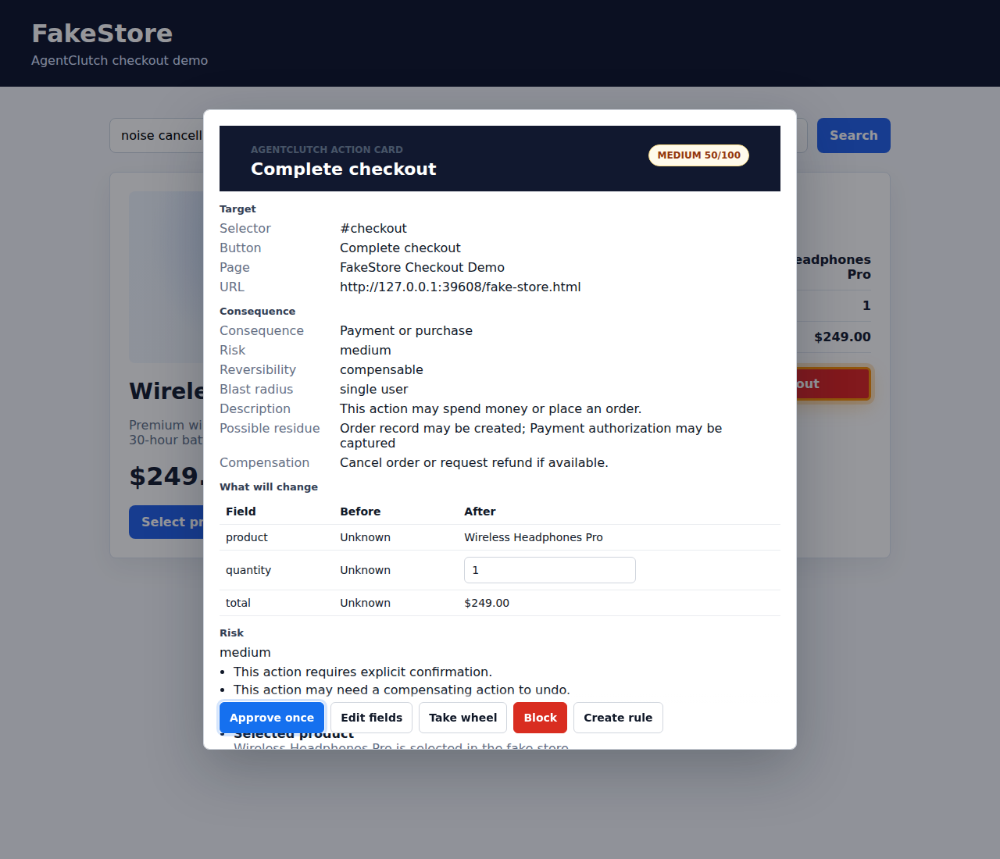
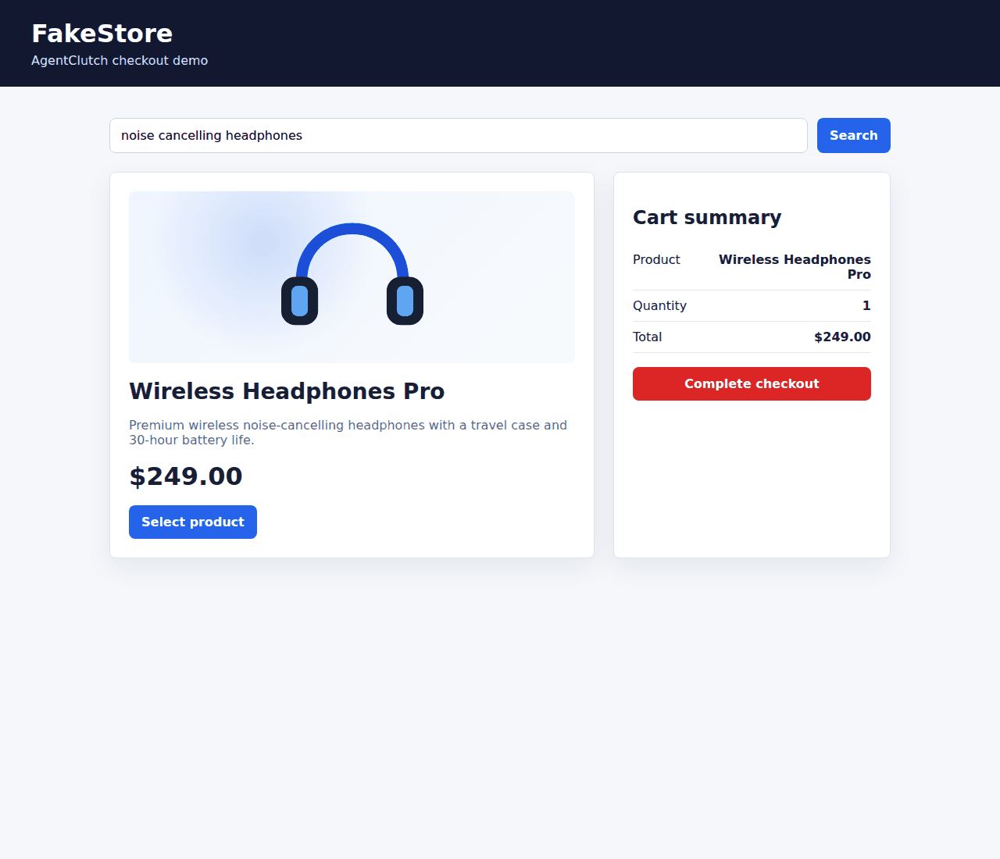
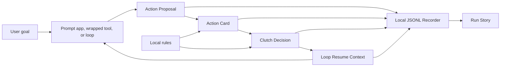
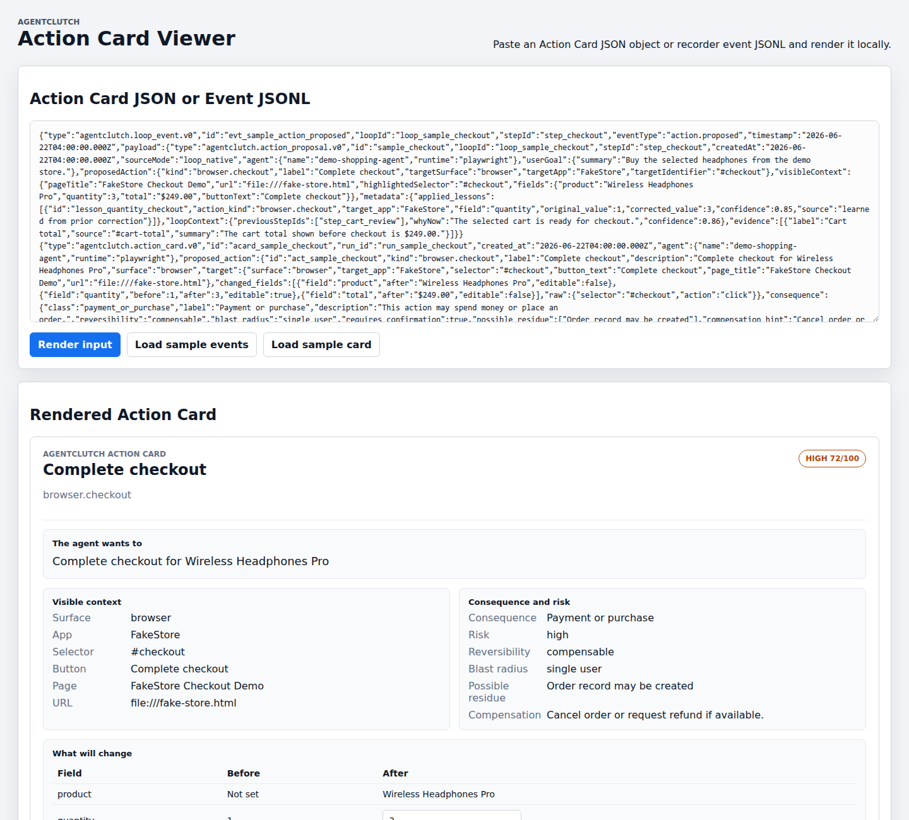

# AgentClutch

**Approve, edit, or take the wheel before agents touch the real world.**

[](https://www.npmjs.com/package/@agentclutch/core)
[](https://github.com/MelaBuilt-AI/agentclutch/actions/workflows/build.yml)
[](https://github.com/MelaBuilt-AI/agentclutch/actions/workflows/test.yml)
[](LICENSE)
[](tsconfig.base.json)


AgentClutch is an open, local-first Action Card and takeover UX layer for consequential AI agent actions. It pauses a proposed side effect before execution, shows what will happen, and returns a structured decision back to the host app or agent loop.

Current milestone: `v0.7.3-alpha.2` is public on GitHub and published to npm as the latest alpha. The repo is a TypeScript pnpm monorepo with Action Cards, loop events, local recording, Playwright browser control, React-compatible UI components, rules, lessons, consequence metadata, Run Story playback, runnable consequential-action examples, and the `@agentclutch/cli` npm package.

## npm Packages

All public packages are published on the npm registry under the [`@agentclutch`](https://www.npmjs.com/org/agentclutch) scope. Use the explicit `@alpha` tag while the APIs are pre-stable.

| Package | npm | Purpose |
| --- | --- | --- |
| [`@agentclutch/action-card`](https://www.npmjs.com/package/@agentclutch/action-card) | [](https://www.npmjs.com/package/@agentclutch/action-card) | Action Card types, schemas, builders, and validation |
| [`@agentclutch/loop`](https://www.npmjs.com/package/@agentclutch/loop) | [](https://www.npmjs.com/package/@agentclutch/loop) | Loop events, normalization, adapters, and resume context |
| [`@agentclutch/recorder`](https://www.npmjs.com/package/@agentclutch/recorder) | [](https://www.npmjs.com/package/@agentclutch/recorder) | Local JSONL recording and run storage |
| [`@agentclutch/core`](https://www.npmjs.com/package/@agentclutch/core) | [](https://www.npmjs.com/package/@agentclutch/core) | Main AgentClutch SDK and consequence engine |
| [`@agentclutch/react`](https://www.npmjs.com/package/@agentclutch/react) | [](https://www.npmjs.com/package/@agentclutch/react) | React-compatible Action Card and takeover components |
| [`@agentclutch/playwright`](https://www.npmjs.com/package/@agentclutch/playwright) | [](https://www.npmjs.com/package/@agentclutch/playwright) | Playwright clutch points and browser overlay |
| [`@agentclutch/cli`](https://www.npmjs.com/package/@agentclutch/cli) | [](https://www.npmjs.com/package/@agentclutch/cli) | CLI smoke, demos, and local run inspection |

```bash
pnpm dlx @agentclutch/cli@alpha smoke
```

## 30-Second Explanation

Agents are moving from chat into action: clicking checkout, sending messages, deleting files, changing records, and calling tools. Raw logs and chat transcripts are not enough at the moment something consequential is about to happen.

AgentClutch owns that moment:

1. A prompt app, wrapped tool, or engineered loop proposes an action.
2. AgentClutch normalizes it into an `ActionProposal`.
3. The proposal becomes an inspectable `ActionCard`.
4. The human approves once, edits fields, takes the wheel, blocks, or creates a rule.
5. AgentClutch records the intervention and returns `LoopResumeContext`.
6. The run can be replayed as a human-readable Run Story.

It is loop-native internally and prompt-compatible at the SDK edge. It is not a generic agent framework, chat UI, browser agent, observability dashboard, or hosted approval product.

## FakeStore Interactive Demo

FakeStore is a local interactive demo. It opens a browser, loads a local fake store page, simulates an agent preparing to buy headphones, and pauses before the checkout button can create the side effect.

Install once:

```bash
pnpm install --frozen-lockfile
pnpm build
pnpm exec playwright install chromium
```

Run the demo:

```bash
pnpm demo:checkout
```

Demo flow:

1. A browser opens FakeStore from the local repo.
2. The demo agent searches, selects `Wireless Headphones Pro`, and proposes checkout.
3. AgentClutch pauses before clicking `#checkout`.
4. The Action Card shows the target, product, quantity, total, evidence, consequence, and risk.
5. The user can approve once, edit quantity, block, take wheel, or create a rule.
6. If the user edits quantity from `1` to `3`, Teach Mode can capture that correction as a lesson.
7. On future matching runs, the Action Card can show the learned lesson before the user decides.

The demo is intentionally local. It uses a fake store page, local rules, local lessons, and local JSONL run recording under `.agentclutch/`.

**Screenshot:** Real FakeStore checkout Action Card overlay captured from the local demo.



**Demo GIF:** FakeStore search -> clutch point -> approve once -> local checkout completion.



Public npm alpha CLI smoke command:

```bash
pnpm dlx @agentclutch/cli@alpha smoke
```

The smoke command verifies the npm-installed CLI entrypoint without needing a source checkout. The full FakeStore browser demo currently uses local demo assets from this repo; from a clone, run `pnpm demo:checkout --seed-allow-rule`.

## Quick Start

### `prompt_guard`

For one prompt and one risky action:

```ts
import { createClutch } from "@agentclutch/core";

const clutch = createClutch({ runId: "run_email_001", renderer });

const { decision, resumeContext } = await clutch.confirmAction({
  userGoal: {
    original: "Send a follow-up email to the client",
    summary: "Send follow-up email",
  },
  proposedAction: {
    kind: "email.send",
    label: "Send email",
    targetSurface: "email",
    targetApp: "Gmail",
    rawInput: {
      to: "client@example.com",
      subject: "Follow-up from today",
    },
  },
  riskHints: {
    requiresApproval: true,
    reversibility: "not_reversible",
    blastRadius: "external",
  },
});

if (decision.type === "approve_once") {
  await sendEmail();
}
```

### `tool_wrapper`

For browser actions, shell commands, file writes, API calls, and other wrapped functions:

```ts
import { attachClutch } from "@agentclutch/playwright";

const clutch = await attachClutch(page, {
  runId: "run_checkout_001",
  agentName: "browser-agent",
});

await clutch.click("#checkout", {
  kind: "browser.checkout",
  label: "Complete checkout",
  targetApp: "FakeStore",
  changedFields: [
    { field: "product", after: "Wireless Headphones Pro", editable: false },
    { field: "quantity", after: 1, editable: true },
    { field: "total", after: "$249.00", editable: false },
  ],
});
```

### `loop_native`

For engineered observe-plan-act loops:

```ts
import { normalizeActionProposal } from "@agentclutch/loop";

const proposal = normalizeActionProposal({
  sourceMode: "loop_native",
  loopId: "loop_checkout_001",
  stepId: "step_checkout",
  proposedAction: {
    kind: "browser.checkout",
    label: "Complete checkout",
    targetSurface: "browser",
    targetApp: "FakeStore",
    targetIdentifier: "#checkout",
  },
  riskHints: {
    requiresApproval: true,
    reversibility: "compensable",
    blastRadius: "single_user",
  },
});

const { decision, resumeContext } = await clutch.onActionProposed(proposal);

await agentLoop.resume(resumeContext);
```

## Architecture



The core chain is:

```text
Action Proposal -> Action Card -> Clutch Decision -> Resume Context -> Run Story
```

## Progressive Adoption

AgentClutch keeps the same artifact chain across three adoption levels:

| Level          | Use when                                                                                       | Entry point                                                                        |
| -------------- | ---------------------------------------------------------------------------------------------- | ---------------------------------------------------------------------------------- |
| `prompt_guard` | You have a prompt-driven app about to execute one risky action.                                | `clutch.confirmAction(...)`                                                        |
| `tool_wrapper` | You have browser actions, shell commands, file writes, API calls, or other functions to guard. | `clutch.wrapTool(...)`, `clutch.click(...)`, `clutch.submit(...)`                  |
| `loop_native`  | You have explicit loop IDs, step IDs, state, plans, and resume behavior.                       | `normalizeActionProposal(...)`, `onActionProposed(...)`, `buildResumeContext(...)` |

Start with one prompt and one risky action. Grow into full loop control when the host app is ready.

## Rules

Local rules control whether matching actions are allowed, blocked, or forced through an Action Card:

- `allow`: skip the overlay and approve the matching action once.
- `block`: skip the overlay and prevent the matching action.
- `require_clutch`: show the Action Card for the matching action.

Rules live in `.agentclutch/rules/rules.json` for the local demo. They are explicit control policy, separate from correction memory.

## Teach Mode / Lessons

Rules and lessons are separate:

- Rules decide whether matching actions are allowed, blocked, or forced through an Action Card.
- Lessons remember user corrections, such as quantity `1` -> `3`.
- Lessons do not silently approve actions.
- The Action Card still appears for matching lessons unless an explicit `allow` rule exists.

When a user edits a proposed action, the Lesson Engine can capture that correction as a local lesson, apply it to similar future proposals, and let the user accept, reject, or disable the applied lesson.

Lessons live in `.agentclutch/lessons/lessons.json` in the local-first setup. Rules still decide whether an action is allowed, blocked, or forced through a clutch point; lessons only help shape the proposed action shown at that point.

## Viewer

The local viewer renders Action Card JSON and recorder JSONL, then generates a Run Story timeline.

```bash
pnpm --filter @agentclutch/action-card-viewer dev
```

Open the Vite URL printed in the terminal, usually:

```text
http://127.0.0.1:5173/
```



You can also summarize the latest recorded run from the CLI after building:

```bash
pnpm agentclutch inspect latest
```

The package-level CLI exposes the `agentclutch` binary for npm installs. From a clone, use the local root script above; from npm, use `pnpm dlx @agentclutch/cli@alpha smoke` or `pnpm dlx @agentclutch/cli@alpha --help`.

## Packages

| Package | Latest npm alpha version | Purpose | Docs |
| --- | --- | --- | --- |
| `@agentclutch/action-card` | `0.7.3-alpha.1` | Action Card types, schema, builders, and validation. | [README](packages/action-card/README.md) |
| `@agentclutch/loop` | `0.7.3-alpha.1` | Action Proposal, Clutch Decision, loop events, and Resume Context. | [README](packages/loop/README.md) |
| `@agentclutch/core` | `0.7.3-alpha.1` | Consequence classification, risk scoring, sessions, lessons, facade APIs, and Run Story helpers. | [README](packages/core/README.md) |
| `@agentclutch/recorder` | `0.7.3-alpha.1` | Local JSONL run recording. | [README](packages/recorder/README.md) |
| `@agentclutch/playwright` | `0.7.3-alpha.1` | Explicit browser action wrapper and local rule evaluation. | [README](packages/playwright/README.md) |
| `@agentclutch/react` | `0.7.3-alpha.1` | Reusable Action Card and Run Story UI components. | [README](packages/react/README.md) |
| `@agentclutch/cli` | `0.7.3-alpha.1` | Local demo commands and run inspection. | [README](packages/cli/README.md) |

Apps:

- `apps/browser-demo`: local fake store checkout page.
- `apps/action-card-viewer`: local Action Card and Run Story viewer.

Examples:

- `examples/prompt-guard-send-email` — runnable prompt-guard email send
- `examples/tool-wrapper-file-delete` — runnable wrapped local temp-file delete
- `examples/expense-submit` — runnable expense form submission with edit approval
- `examples/github-pr-create` — runnable GitHub PR creation proposal
- `examples/loop-native-checkout`
- `examples/npm-consumer-basic` — minimal external npm consumer-style example
- [Examples index](examples/README.md)

## Documentation

- [Quickstart](docs/quickstart.md)
- [npm publishing notes](docs/npm-publishing.md)
- [Known limitations](docs/limitations.md)
- [Security policy](SECURITY.md)
- [Launch announcement drafts](docs/launch-announcement-drafts.md)
- [Demo script](docs/demo-script.md)
- [Launch checklist](docs/launch-checklist.md)
- [Architecture](docs/architecture.md)
- [Action Cards](docs/action-cards.md)
- [Loops](docs/loops.md)
- [Playwright Adapter](docs/playwright.md)
- [React Components](docs/react-components.md)
- [Recorder](docs/recorder.md)
- [Run Story](docs/run-story.md)

## Development

Requirements:

- Node.js 22+
- pnpm 11+
- Linux, WSL2 Ubuntu, or native Windows

Common commands:

```bash
pnpm install --frozen-lockfile
pnpm build
pnpm typecheck
pnpm test
pnpm demo:checkout --clear-rules
pnpm agentclutch inspect latest
```

## Roadmap

Current alpha:

- Keep the checkout demo simple, visual, and local.
- Support approve once, edit quantity, block, create rule, lesson creation, lesson reuse, and seeded local rules.
- Keep Run Story generation tied to structured recorder events.

Current: `v0.7.3-alpha.1` public GitHub prerelease and npm alpha.

- Adds a consequence registry.
- Adds reversibility, compensation, and residue metadata.
- Shows consequence details in Action Cards, the viewer, and Run Story summaries.

Out of scope for the current milestone:

- MCP
- AG-UI
- CHAP
- Cloud sync
- Desktop overlay

See [Known Limitations](docs/limitations.md) for the full alpha caveat list.
