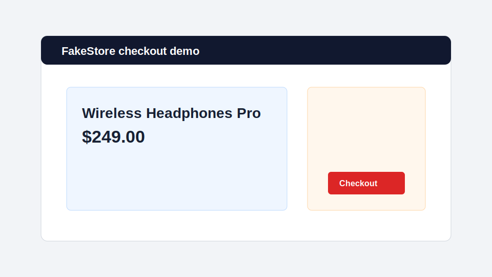
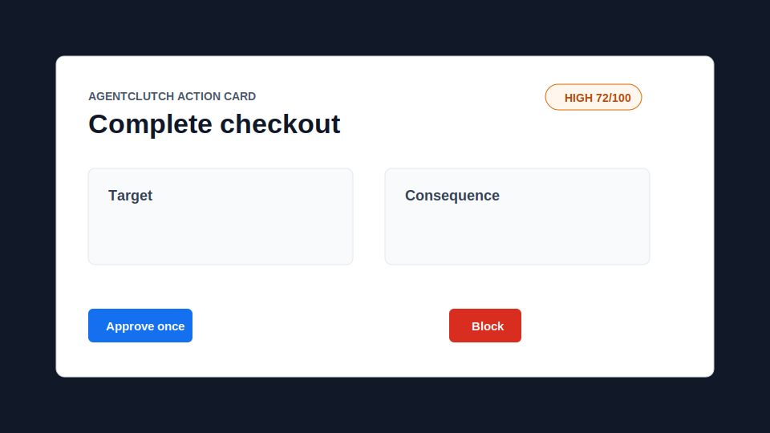
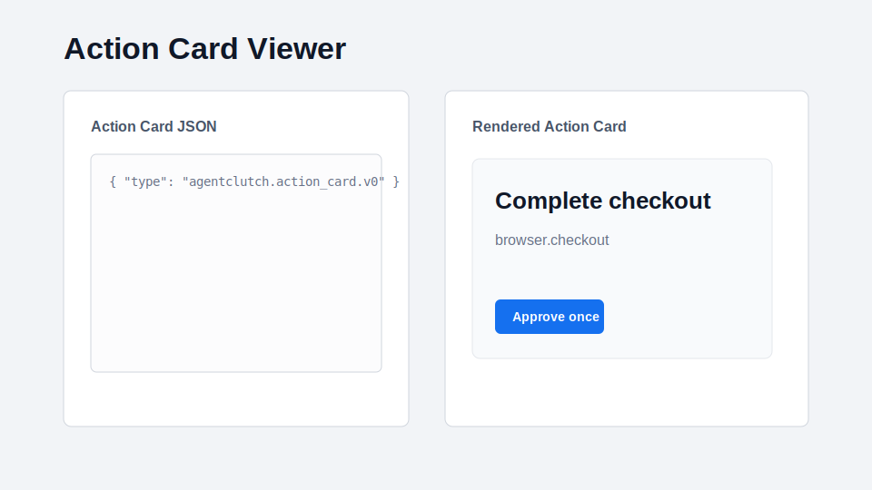
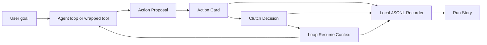

# AgentClutch

**Approve, edit, or take the wheel before agents touch the real world.**

AgentClutch is an open Action Card and takeover UX layer for consequential AI agent actions. It sits at the moment before an agent submits a form, sends a message, checks out, writes files, changes permissions, merges code, deploys, or calls a tool that can affect real systems.



## What AgentClutch Is

AgentClutch is a local-first control surface for proposed agent actions:

- Normalizes proposed actions into loop-native `ActionProposal` objects.
- Converts proposals into inspectable `ActionCard` objects.
- Lets users approve once, edit fields, take the wheel, block, or create a rule.
- Builds structured `LoopResumeContext` payloads so the host loop can continue correctly.
- Records local JSONL events for replay, audit, and Run Stories.

## What AgentClutch Is Not

AgentClutch is not:

- A general agent framework.
- A browser agent or desktop agent.
- A chat UI or prompt builder.
- A generic observability dashboard.
- A SaaS backend, cloud sync layer, governance platform, or compliance product.
- A replacement for native browser, OS, identity, or enterprise approval systems.

It owns one narrow boundary: the human-control moment before consequential side effects.

## Installation

```bash
pnpm install
pnpm build
pnpm test
pnpm typecheck
```

Requirements:

- Node.js 22+
- pnpm 11+
- Linux, WSL2 Ubuntu, or native Windows

For the browser demo:

```bash
pnpm exec playwright install chromium
```

## Quick Start

### Browser Action Wrapper

```ts
import { attachClutch } from "@agentclutch/playwright";

const clutch = await attachClutch(page, {
  runId: "run_001",
  agentName: "browser-agent"
});

await clutch.click("#checkout", {
  kind: "browser.checkout",
  label: "Complete checkout",
  changedFields: [
    { field: "product", after: "Wireless Headphones Pro", editable: false },
    { field: "total", after: "$249.00", editable: false }
  ]
});
```

### React Action Card

```ts
import { ActionCard } from "@agentclutch/react";
import "@agentclutch/react/styles.css";

ActionCard({
  card,
  onDecision(decision) {
    console.log(decision);
  }
});
```

## Browser Demo

The local fake store demo launches Chromium, opens a static checkout page, simulates a simple shopping flow, and shows an AgentClutch Action Card before clicking `#checkout`.

```bash
pnpm demo:checkout
```

The run is recorded locally:

```text
.agentclutch/runs/<run_id>/events.jsonl
```



## Action Card Viewer

The local viewer app renders a sample Action Card by default and lets you paste Action Card JSON for validation and rendering.

```bash
pnpm --filter @agentclutch/action-card-viewer dev
```

Open the Vite URL printed in the terminal, usually:

```text
http://127.0.0.1:5173/
```



## Architecture



The core pipeline is:

```text
proposed side effect
  -> ActionProposalInput
  -> normalizeActionProposal(...)
  -> ActionCard
  -> user decision
  -> LoopResumeContext
  -> execute, edit, block, or handoff
```

## Progressive Adoption Model

AgentClutch is loop-native internally and prompt-compatible at the SDK edge.

### `prompt_guard`

For prompt-based apps that are about to execute one risky action. The app passes the user goal and proposed action to AgentClutch, receives a decision, and only executes when allowed.

### `tool_wrapper`

For tools, MCP calls, browser actions, shell commands, file writes, SaaS writes, and API calls. The current Playwright adapter uses this mode.

### `loop_native`

For engineered observe-plan-act loops that already have explicit loop IDs, step IDs, state, plans, and resume behavior. AgentClutch acts as the clutch point inside that loop.

## Packages

- `@agentclutch/action-card` - Action Card types, schema, builders, and validation.
- `@agentclutch/loop` - Action Proposal, Clutch Decision, loop events, and Resume Context.
- `@agentclutch/core` - consequence classification, risk scoring, sessions, and Run Story helpers.
- `@agentclutch/recorder` - local JSONL run recording.
- `@agentclutch/playwright` - explicit browser action wrapper.
- `@agentclutch/react` - reusable Action Card UI components.
- `@agentclutch/cli` - local demos.

## Apps

- `apps/browser-demo` - static fake store checkout demo page.
- `apps/action-card-viewer` - local Action Card JSON viewer.

## Examples

- `examples/prompt-guard-send-email`
- `examples/tool-wrapper-file-delete`
- `examples/loop-native-checkout`

## Documentation

- [Architecture](docs/architecture.md)
- [Action Cards](docs/action-cards.md)
- [Loops](docs/loops.md)
- [Recorder](docs/recorder.md)
- [Playwright Adapter](docs/playwright.md)
- [React Components](docs/react-components.md)
- [Run Story](docs/run-story.md)

## Development

```bash
pnpm typecheck
pnpm test
pnpm build
```

CI runs these checks on Ubuntu and Windows.

## Roadmap Boundaries

The open-source MVP intentionally avoids MCP bridges, AG-UI, CHAP, desktop overlays, SaaS backends, cloud sync, and hosted telemetry. Those may be future integrations, but the core launch target is a small, local-first control layer for consequential actions.
