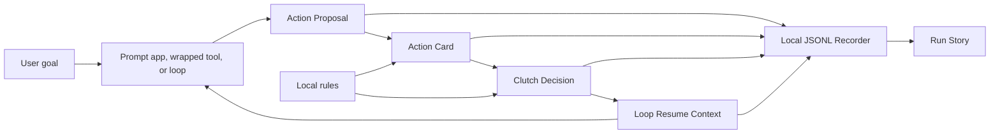

# AgentClutch

**Approve, edit, or take the wheel before agents touch the real world.**

AgentClutch is an open Action Card and takeover UX layer for consequential AI agent actions. It pauses a proposed side effect before execution, shows what will happen, and returns a structured decision back to the host app or agent loop.


## 30-Second Explanation

Agents are moving from chat into action: clicking checkout, sending messages, deleting files, changing records, and calling tools. Raw logs and chat transcripts are not enough at the moment something consequential is about to happen.

AgentClutch owns that moment:

1. A prompt app, wrapped tool, or engineered loop proposes an action.
2. AgentClutch normalizes it into an `ActionProposal`.
3. The proposal becomes an inspectable `ActionCard`.
4. The human approves once, edits fields, takes the wheel, blocks, or creates a rule.
5. AgentClutch records the intervention and returns `LoopResumeContext`.
6. The run can be replayed as a human-readable Run Story.

It is loop-native internally and prompt-compatible at the SDK edge. It is not a generic agent framework, chat UI, browser agent, observability dashboard, or hosted approval product.

## Demo

```bash
pnpm install
pnpm build
pnpm exec playwright install chromium
pnpm demo:checkout --clear-rules
```

The checkout demo opens a local fake store, simulates an agent preparing to buy headphones, freezes before `#checkout`, highlights the target button, and displays an Action Card.

After publishing, the intended public command is:

```bash
npx agentclutch demo checkout
```


## Quick Start

### `prompt_guard`

For one prompt and one risky action:

```ts
import { createClutch } from "@agentclutch/core";

const clutch = createClutch({ runId: "run_email_001", renderer });

const { decision, resumeContext } = await clutch.confirmAction({
  userGoal: {
    original: "Send a follow-up email to the client",
    summary: "Send follow-up email"
  },
  proposedAction: {
    kind: "email.send",
    label: "Send email",
    targetSurface: "email",
    targetApp: "Gmail",
    rawInput: {
      to: "client@example.com",
      subject: "Follow-up from today"
    }
  },
  riskHints: {
    requiresApproval: true,
    reversibility: "not_reversible",
    blastRadius: "external"
  }
});

if (decision.type === "approve_once") {
  await sendEmail();
}
```

### `tool_wrapper`

For browser actions, shell commands, file writes, API calls, and other wrapped functions:

```ts
import { attachClutch } from "@agentclutch/playwright";

const clutch = await attachClutch(page, {
  runId: "run_checkout_001",
  agentName: "browser-agent"
});

await clutch.click("#checkout", {
  kind: "browser.checkout",
  label: "Complete checkout",
  targetApp: "FakeStore",
  changedFields: [
    { field: "product", after: "Wireless Headphones Pro", editable: false },
    { field: "quantity", after: 1, editable: true },
    { field: "total", after: "$249.00", editable: false }
  ]
});
```

### `loop_native`

For engineered observe-plan-act loops:

```ts
import { normalizeActionProposal } from "@agentclutch/loop";

const proposal = normalizeActionProposal({
  sourceMode: "loop_native",
  loopId: "loop_checkout_001",
  stepId: "step_checkout",
  proposedAction: {
    kind: "browser.checkout",
    label: "Complete checkout",
    targetSurface: "browser",
    targetApp: "FakeStore",
    targetIdentifier: "#checkout"
  },
  riskHints: {
    requiresApproval: true,
    reversibility: "compensable",
    blastRadius: "single_user"
  }
});

const { decision, resumeContext } = await clutch.onActionProposed(proposal);

await agentLoop.resume(resumeContext);
```

## Architecture



The core chain is:

```text
Action Proposal -> Action Card -> Clutch Decision -> Resume Context -> Run Story
```

## Progressive Adoption

AgentClutch keeps the same artifact chain across three adoption levels:

| Level | Use when | Entry point |
| --- | --- | --- |
| `prompt_guard` | You have a prompt-driven app about to execute one risky action. | `clutch.confirmAction(...)` |
| `tool_wrapper` | You have browser actions, shell commands, file writes, API calls, or other functions to guard. | `clutch.wrapTool(...)`, `clutch.click(...)`, `clutch.submit(...)` |
| `loop_native` | You have explicit loop IDs, step IDs, state, plans, and resume behavior. | `normalizeActionProposal(...)`, `onActionProposed(...)`, `buildResumeContext(...)` |

Start with one prompt and one risky action. Grow into full loop control when the host app is ready.

## Rules

Local rules control whether matching actions are allowed, blocked, or forced through an Action Card:

- `allow`: skip the overlay and approve the matching action once.
- `block`: skip the overlay and prevent the matching action.
- `require_clutch`: show the Action Card for the matching action.

Rules live in `.agentclutch/rules/rules.json` for the local demo. They are explicit control policy. Future Teach Mode is separate: it will remember user corrections and preferences, but it is not part of this launch task or current product behavior.

## Viewer

The local viewer renders Action Card JSON and recorder JSONL, then generates a Run Story timeline.

```bash
pnpm --filter @agentclutch/action-card-viewer dev
```

Open the Vite URL printed in the terminal, usually:

```text
http://127.0.0.1:5173/
```


## Packages

| Package | Purpose |
| --- | --- |
| `@agentclutch/action-card` | Action Card types, schema, builders, and validation. |
| `@agentclutch/loop` | Action Proposal, Clutch Decision, loop events, and Resume Context. |
| `@agentclutch/core` | Consequence classification, risk scoring, sessions, facade APIs, and Run Story helpers. |
| `@agentclutch/recorder` | Local JSONL run recording. |
| `@agentclutch/playwright` | Explicit browser action wrapper and local rule evaluation. |
| `@agentclutch/react` | Reusable Action Card and Run Story UI components. |
| `@agentclutch/cli` | Local demo commands. |

Apps:

- `apps/browser-demo`: local fake store checkout page.
- `apps/action-card-viewer`: local Action Card and Run Story viewer.

Examples:

- `examples/prompt-guard-send-email`
- `examples/tool-wrapper-file-delete`
- `examples/loop-native-checkout`
- [Examples index](examples/README.md)

## Documentation

- [Demo script](docs/demo-script.md)
- [Launch checklist](docs/launch-checklist.md)
- [Architecture](docs/architecture.md)
- [Action Cards](docs/action-cards.md)
- [Loops](docs/loops.md)
- [Playwright Adapter](docs/playwright.md)
- [React Components](docs/react-components.md)
- [Recorder](docs/recorder.md)
- [Run Story](docs/run-story.md)

## Development

Requirements:

- Node.js 22+
- pnpm 11+
- Linux, WSL2 Ubuntu, or native Windows

Common commands:

```bash
pnpm install
pnpm build
pnpm typecheck
pnpm test
pnpm demo:checkout --clear-rules
```

## Roadmap

Now:

- Keep the checkout demo simple, visual, and local.
- Make approve, edit quantity, block, create rule, and seeded local rules easy to demo.
- Keep Run Story generation tied to structured recorder events.

Next:

- Add more example code around `prompt_guard`, `tool_wrapper`, and `loop_native`.
- Expand tests around rule decisions and recorder-to-story flows.
- Improve screenshot and GIF assets for launch.

Later:

- Add more adapters only after the Action Proposal, Action Card, Decision, Resume Context, and Run Story chain is stable.
- Keep the open-source core local-first, testable, and small.
